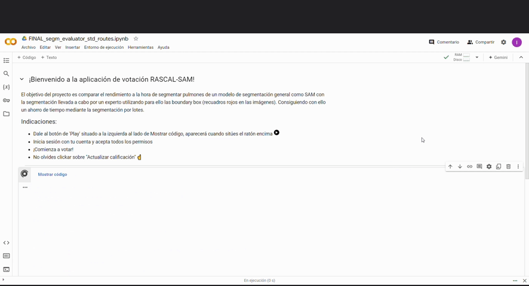

# 🎉 Welcome to the RASCAL-SAM Voting App! 🎉

The goal of this project is to compare the performance of a general segmentation model like **SAM** with expert-driven lung segmentation using boundary boxes (red squares in the images). By leveraging batch segmentation, this approach aims to save time while maintaining accuracy.

## 🛠️ How to Use:

1. **Press the 'Play' button** ▶️ on the left next to "Show code" (it will appear when you hover over it).
2. **Log in with your account** and accept all the permissions.
3. **Start voting!** 🗳️
4. Don't forget to click **"Update rating"** ☝️ when you're done!

Thank you for your participation, and happy voting! 🙌

